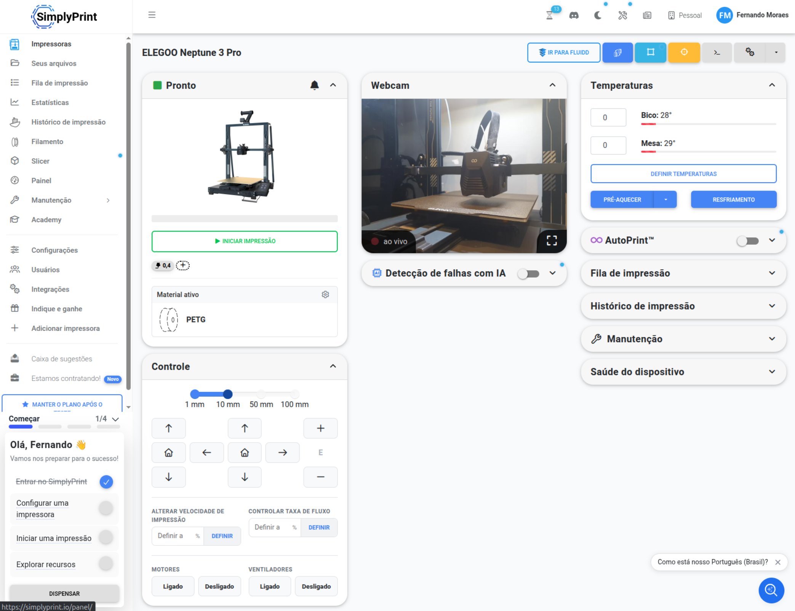

# 使用 SimplyPrint

**语言: [English](../simplyprint.md) · [Português (BR)](../pt-br/simplyprint.md) · [简体中文](simplyprint.md)**

[SimplyPrint](https://simplyprint.io) 是一个 3D 打印平台，提供远程监控、打印管理和 AI 故障检测。
KlipPocket 内置的 Moonraker 已经包含 SimplyPrint 连接，因此无需安装任何东西：
只需在 Moonraker 配置中开启它，并把打印机关联到你的 SimplyPrint 账号。

<p align="center"></p>

## 你需要什么

- 在 KlipPocket 中**运行**的打印机配置，并且已在浏览器中打开 Fluidd 或 Mainsail——参见
  [`getting-started.md`](getting-started.md)。
- 一个 [simplyprint.io](https://simplyprint.io) 的免费账号。

## 1. 在 `moonraker.conf` 中开启

1. 在 Fluidd/Mainsail 编辑器中打开 `moonraker.conf`
   （Fluidd：**{…} Configuration**，Mainsail：**Machine**）。
2. 如果文件里还没有，请在最底部添加这一行：

   ```ini
   [simplyprint]
   ```

   > 请先确认文件里没有已存在的 `[simplyprint]` 配置段。重复的配置段会导致 Moonraker 无法启动。

3. 点击 **Save & Restart**。

## 2. 获取设置代码

1. 等待几秒钟让 Moonraker 恢复，然后点击 Fluidd/Mainsail 顶部栏的**铃铛**图标。
2. 打开 **SimplyPrint Setup Request** 通知，复制其中显示的设置代码。

## 3. 关联打印机

1. 打开 [simplyprint.io](https://simplyprint.io) 并登录。
2. 选择 **Add Printer**，粘贴设置代码。
3. 确认连接。打印机随后会出现在你的 SimplyPrint 面板中。

如果打印机已经出现在 SimplyPrint 的 **Pending Printers** 中，可以直接从那里添加，无需输入代码。

## 摄像头

SimplyPrint 获取摄像头的方式与 Fluidd/Mainsail 相同：通过 Moonraker 自己的摄像头列表。
启用摄像头服务器，并在 Fluidd 或 Mainsail 中添加一次（二者共用配置），SimplyPrint 就会自动使用它——
带截图的完整步骤：[`webcam.md`](webcam.md)。

## 说明

- 每个打印机配置都有自己的 `moonraker.conf`，因此想接入 SimplyPrint 的每个配置都要重复这些步骤。
- SimplyPrint 需要 Moonraker v0.8.0 或更新版本；这里内置的版本更新。

## 官方指南

SimplyPrint 针对 Klipper 打印机的官方说明：
<https://simplyprint.io/setup-guide/methods/klipper-powered>
